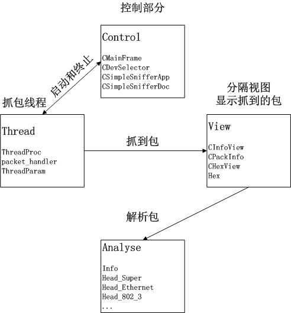
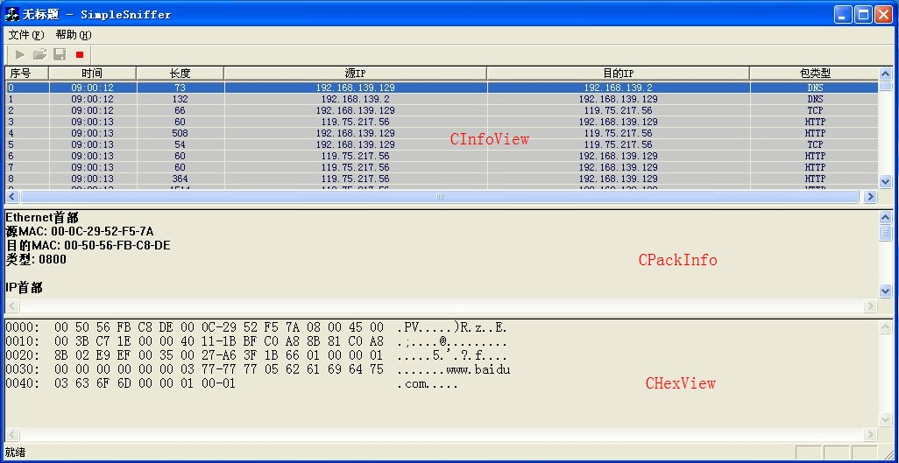

<h1 align="center"><b>概要设计
</b></h1>

# 一、概述

* 项目名称：网络抓包软件设计
* 项目成员：刘乔羽（03091445）杨延中（03091388）周旭（03091356）
* 项目描述：目前，有许多流行的网络抓包软件可以获取流经网卡的数据包(ethereal, sniffer)，这个题目要求学生利用winpcap库设计并实现一个网络抓包的原型系统。
* 项目目标：实现一个网络抓包系统
* 项目功能
	1. 搜索并显示所有的网卡设备
	2. 根据所选网卡进行抓包操作，并显示数据包的基本
	信息，eg：类型、时间、IP地址等信息
	3. 对数据包进行详细分析，显示数据内容

# 二、系统结构设计

# 三、接口设计

## 用户界面

## 模块间的接口

<table border="1">
 <tr>
  <th>接口</th>
  <th>调用者</th>
  <th>实现者</th>
  <th>调用形式</th>
 </tr>
 <tr>
  <td>UINT ThreadProc(LPVOID param);</td>
  <td>控制部分</td>
  <td>抓包线程</td>
  <td>启动线程</td>
 </tr>
 <tr>
  <td>void OnTExit(int exitNum);</td>
  <td>抓包线程</td>
  <td>控制部分</td>
  <td>消息</td>
 </tr>
 <tr>
  <td>void OnTCatch(struct pcap_pkthdr *header, u_char *pkt_data);</td>
  <td>抓包线程</td>
  <td>分隔视图</td>
  <td>消息</td>
 </tr>
 <tr>
  <td>
   virtual void analysis(u_char *pkt_data)=0; 
   virtual CString my_print()=0;</td>
  <td>分隔视图</td>
  <td>解析包</td>
  <td>函数调用</td>
 </tr>
</table>
